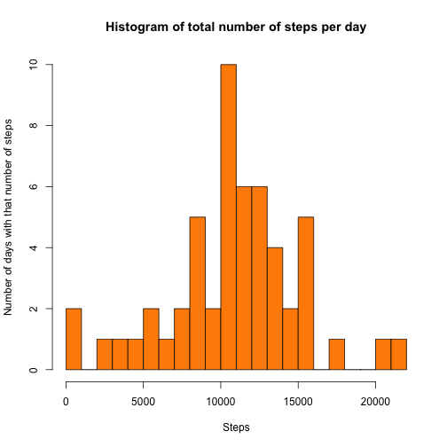
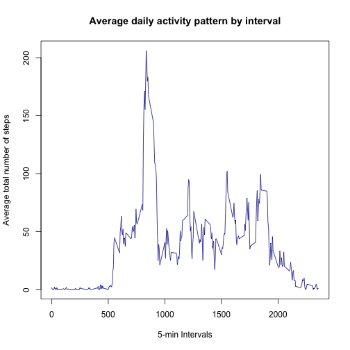
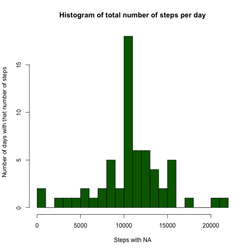
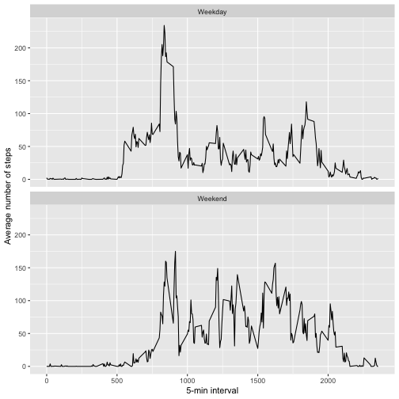

## Introduction

This is an R Markdown document in which I put all the code needed to fulfill the Week 2 assignment of the Reproducible Research course. 


## Loading and preprocessing the data

This is the code to read the file. 


```r
unzip("repdata_data_activity.zip", exdir = "./Activity")
```

```
## Warning in unzip("repdata_data_activity.zip", exdir = "./Activity"): erreur 1 lors de l'extraction d'un fichier zip
```

```r
setwd(dir = "./Activity")

library(data.table)
library(dplyr)

act <- read.csv("./activity.csv", header = TRUE, sep = ",", na.strings = "NA")
```

I'm looking some features of the data. 

There is no need to change the format of the table (already set in "data.frame"). But it could be interesting to convert the date into the *right* format instead of the *character* one. 


```r
act$date <- as.POSIXct(act$date, tryFormats = "%Y-%m-%d")

dim(act)
```

```
## [1] 17568     3
```

```r
head(act)
```

```
##   steps       date interval
## 1    NA 2012-10-01        0
## 2    NA 2012-10-01        5
## 3    NA 2012-10-01       10
## 4    NA 2012-10-01       15
## 5    NA 2012-10-01       20
## 6    NA 2012-10-01       25
```

```r
str(act)
```

```
## 'data.frame':	17568 obs. of  3 variables:
##  $ steps   : int  NA NA NA NA NA NA NA NA NA NA ...
##  $ date    : POSIXct, format: "2012-10-01" "2012-10-01" "2012-10-01" "2012-10-01" ...
##  $ interval: int  0 5 10 15 20 25 30 35 40 45 ...
```

```r
summary(act)
```

```
##      steps             date                           interval     
##  Min.   :  0.00   Min.   :2012-10-01 00:00:00.00   Min.   :   0.0  
##  1st Qu.:  0.00   1st Qu.:2012-10-16 00:00:00.00   1st Qu.: 588.8  
##  Median :  0.00   Median :2012-10-31 00:00:00.00   Median :1177.5  
##  Mean   : 37.38   Mean   :2012-10-30 23:32:27.53   Mean   :1177.5  
##  3rd Qu.: 12.00   3rd Qu.:2012-11-15 00:00:00.00   3rd Qu.:1766.2  
##  Max.   :806.00   Max.   :2012-11-30 00:00:00.00   Max.   :2355.0  
##  NA's   :2304
```

There is no need to change the format of the table (already set in "data.frame"). But it could be interesting to convert the date into the *right* format instead of the *character* one. 


## What is the mean total number of steps taken per day ?

First, I'll calculate the total amount of steps taken each day.


```r
stepday <- aggregate(act$steps ~ act$date, FUN = sum, na.rm = TRUE)
colnames(stepday) <- c("Date", "Steps")
```

Then I'll do an histogram. I set the breaks at 20 so that each block represents a range of about 1000 steps.  


```r
hist(stepday$Steps, breaks = 20, col = "darkorange", xlab = "Steps", ylab = "Number of days with that number of steps", main = "Histogram of total number of steps per day")
```



Here are the mean and median of the total number of steps taken each day. 


```r
mean <- mean(stepday$Steps, na.rm = TRUE)
median <- median(stepday$Steps, na.rm = TRUE)
```

The mean of the total number of steps a day is **1.0766189 &times; 10<sup>4</sup>** steps and the median is **10765** steps. 


## What is the average daily activity pattern?

This is a time series plot of the 5-minute interval (x-axis) and the average number of steps taken, averaged across all days (y-axis). 


```r
inter_step <- act %>% group_by(interval) %>% summarise(steps = mean(steps, na.rm =TRUE))

with(inter_step, plot(x = interval, y = steps, type = 'l', main = "Average daily activity pattern by interval", xlab = "5-min Intervals", ylab = "Average total number of steps", col = "darkblue"))
```



Which 5-minute interval, on average across all the days in the dataset, contains the maximum number of steps ?


```r
maximum <- inter_step[inter_step$steps == max(inter_step$steps), ]
max_step <- max(inter_step$steps)
max_interval <- maximum[[1]]
```

The **835th** interval contains an average of **206.1698113** steps. 


## Imputing missing values


```r
na_sum <- sum(is.na(act$steps))
na_per <- mean(is.na(act$steps)) * 100
```

There are **2304** missing values in the dataset (**13.1147541%** of the total of observations).

I created a new dataset called *actNA* with all the missing values filled in with the average of the interval.
So, for each row, if there were an NA value, this NA value was replaced by the mean in that interval. 


```r
nrow_NA <- numeric(nrow(act))
for(i in 1:nrow(act)){
  if(is.na(act[i, "steps"]) == TRUE){
    nrow_NA[i] <- filter(inter_step,interval==act[i,"interval"]) %>% select(steps)
  }
  else{
    nrow_NA[i] <- act[i, "steps"]
  }
}

actNA <- mutate(act, NewNA = nrow_NA)
head(actNA)
```

```
##   steps       date interval     NewNA
## 1    NA 2012-10-01        0  1.716981
## 2    NA 2012-10-01        5 0.3396226
## 3    NA 2012-10-01       10 0.1320755
## 4    NA 2012-10-01       15 0.1509434
## 5    NA 2012-10-01       20 0.0754717
## 6    NA 2012-10-01       25   2.09434
```

Now, I make an another histogram with that new table. 


```r
stepday_withNA <- with(actNA, aggregate(as.numeric(NewNA) ~ date, FUN = sum, na.rm = FALSE))
colnames(stepday_withNA) <- c("Date", "Steps_withNA")
hist(stepday_withNA$Steps_withNA, breaks = 20, col = "darkgreen", xlab = "Steps with NA", ylab = "Number of days with that number of steps", main = "Histogram of total number of steps per day")
```



```r
mean_withNA <- mean(stepday_withNA$Steps_withNA, na.rm = FALSE)
median_withNA <- median(stepday_withNA$Steps_withNA, na.rm = FALSE)
```

Now, with replaced NA's, the mean of the total number of steps a day is **1.0766189 &times; 10<sup>4</sup>** steps and the median is **1.0766189 &times; 10<sup>4</sup>** steps. 

The new mean and median have moved towards the mean and median the first histogram because we added 8 days with that mean. Those days weren't taken into account in the first histogram because they had missing data the whole day.  

We added 15.09% of the dataset with the same number/mean.But an other reason could be that I did a mistake in my code...


## Are there differences in activity patterns between weekdays and weekends?

So, I needed to create a new factor variable in the dataset with two levels – “weekday” and “weekend” indicating whether a given date is a weekday or weekend day.


```r
library(lubridate)
actNA$date <- as.POSIXct(actNA$date)
is.weekday <- function(date){
  if(weekdays(date) %in% c("Samedi","Dimanche")){result <- "Weekend"}
  else{result <- "Weekday"}
  result
}
actNA <- mutate(actNA,date=ymd(date)) %>% mutate(day=sapply(date,is.weekday))
table(actNA$day)
```

```
## 
## Weekday Weekend 
##   12960    4608
```

This is the panel according to days.


```r
library(ggplot2)
inter_step_day <- actNA %>% group_by(interval, day) %>% summarise(steps = mean(steps, na.rm =TRUE))
```

```
## `summarise()` has grouped output by 'interval'. You can override using the `.groups` argument.
```

```r
ggplot(inter_step_day, aes(interval, steps)) +
  geom_line() +
  facet_wrap(~day, nrow = 2) +
  xlab("5-min interval") +
  ylab("Average number of steps")
```



This was hard but I managed to do it. 
See you for the next assignment!


